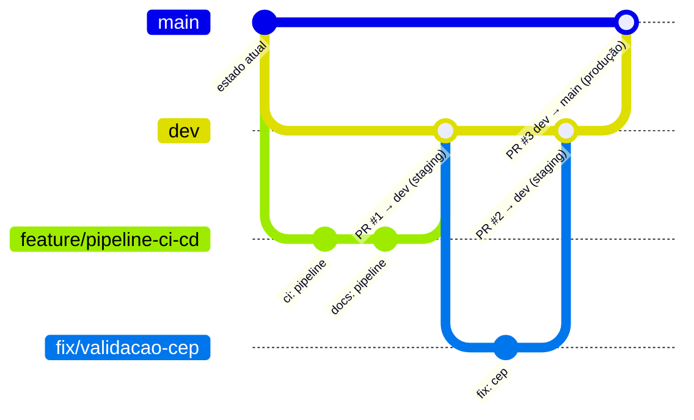
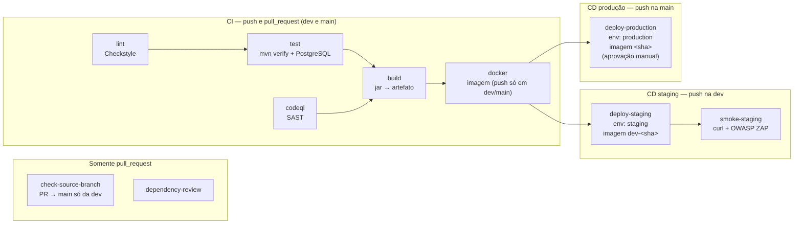

# Pipeline de CI/CD — `.github/workflows/ci-cd.yml`

Documentação do pipeline de Integração e Entrega Contínuas da **API de Gerenciamento de Pacientes** (Spring Boot 3.5.7, Java 21, Maven, PostgreSQL 16, Keycloak).

---

## 1. Visão geral e objetivo

O projeto segue o padrão **GitFlow** (ver [seção 2](#2-fluxo-de-branches)): toda mudança nasce em uma branch de trabalho, entra na `dev` por Pull Request e chega à `main` por um PR `dev → main`. O pipeline acompanha esse fluxo:

1. **Validação do fluxo** — em PRs para a `main`, garante que a origem é a `dev`.
2. **Verificação estática** — lint (Checkstyle), análise de segurança do código (CodeQL) e, em PRs, revisão de dependências vulneráveis.
3. **Verificação dinâmica** — testes automatizados (JUnit 5 + Mockito + teste de contexto Spring com PostgreSQL real).
4. **Build** — geração do `.jar` e da imagem Docker, publicada no GitHub Container Registry (GHCR) com tags que identificam a origem.
5. **Staging ← `dev`** — cada merge na `dev` faz deploy automático em staging, seguido de smoke test (curl) e varredura DAST (OWASP ZAP).
6. **Produção ← `main`** — cada merge `dev → main` faz deploy em produção, após aprovação manual.

Em **pull requests** nunca há deploy: roda só a parte de CI.

Arquivos relacionados:

| Arquivo | Papel |
| :--- | :--- |
| `.github/workflows/ci-cd.yml` | Definição do pipeline |
| `.github/scripts/deploy-ssh.sh` | Deploy da imagem em uma VM via SSH (usado por staging e produção) |
| `.github/scripts/smoke-test.sh` | Smoke test pós-deploy com `curl` |
| `config/checkstyle/checkstyle.xml` | Regras do lint |
| `pom.xml` | Plugin `maven-checkstyle-plugin` (lint) |
| `Dockerfile` / `.dockerignore` | Imagem de execução da API |
| `CONTRIBUTING.md` | Resumo do fluxo de branches para quem contribui |

---

## 2. Fluxo de branches

| Branch | Papel | Recebe mudanças de |
| :--- | :--- | :--- |
| `main` | Código em **produção** | somente PR vindo da `dev` |
| `dev` | Branch de **integração**, publicada em **staging** | PRs vindos de branches de trabalho |
| branches de trabalho | Uma por mudança, criadas a partir da `dev` | commits do autor |

Nenhuma mudança vai direto para a `main` ou para a `dev`: sempre por Pull Request.

### Convenção de nomes (recomendada, **não obrigatória**)

| Prefixo | Uso | Exemplo |
| :--- | :--- | :--- |
| `feature/` | nova funcionalidade | `feature/busca-por-cpf` |
| `fix/` | correção de bug | `fix/validacao-cep` |
| `docs/` | documentação | `docs/atualiza-readme` |
| `refactor/` | refatoração sem mudança de comportamento | `refactor/service-paciente` |
| `chore/` | configuração, dependências, manutenção | `chore/atualiza-spring-boot` |

O nome da branch de trabalho é **livre**: o pipeline não valida prefixos. **A única regra validada automaticamente** (job `check-source-branch`) é: **PR com destino `main` precisa vir da `dev`**. PRs para a `dev` são aceitos de qualquer branch.

### Diagrama



### Passo a passo

1. **Atualize a `dev` e crie sua branch de trabalho a partir dela:**

   ```bash
   git switch dev
   git pull origin dev
   git switch -c feature/minha-mudanca
   ```

2. **Faça commits** (de preferência no padrão Conventional Commits) e envie a branch:

   ```bash
   git push -u origin feature/minha-mudanca
   ```

3. **Abra um PR `feature/minha-mudanca → dev`.** O CI roda (validação de origem, lint, CodeQL, dependency review, testes e build). Com tudo verde e revisão aprovada, faça o merge.
4. **O merge na `dev` dispara o deploy em staging** + smoke test + OWASP ZAP. Valide a mudança em staging.
5. **Abra um PR `dev → main`** quando quiser liberar para produção. O CI roda de novo; o job *Validar branch de origem* confirma que a origem é a `dev`.
6. **O merge na `main` dispara o deploy em produção**, que aguarda a aprovação de um revisor do environment `production`.

---

## 3. Diagrama do fluxo dos jobs



`check-source-branch` e `dependency-review` rodam em paralelo e não bloqueiam os outros jobs do mesmo run; o bloqueio do merge acontece quando eles são configurados como **required status checks** na proteção das branches (ver [seção 10](#10-passos-manuais-no-github)).

---

## 4. Gatilhos (`on:`) e quando cada job executa

```yaml
on:
  push:
    branches: [dev, main]
  pull_request:
    branches: [dev, main]
  workflow_dispatch:
```

Push em branches de trabalho **não** dispara o pipeline; elas são validadas quando o PR para a `dev` é aberto (e a cada novo push no PR).

| Job | PR → `dev` | PR → `main` | Push na `dev` | Push na `main` | `workflow_dispatch` |
| :--- | :---: | :---: | :---: | :---: | :---: |
| `check-source-branch` | ✅ (sempre passa) | ✅ (falha se origem ≠ `dev`) | — | — | — |
| `dependency-review` | ✅ | ✅ | — | — | — |
| `lint` | ✅ | ✅ | ✅ | ✅ | ✅ |
| `codeql` | ✅ | ✅ | ✅ | ✅ | ✅ |
| `test` | ✅ | ✅ | ✅ | ✅ | ✅ |
| `build` | ✅ | ✅ | ✅ | ✅ | ✅ |
| `docker` | build sem push (`pr-N`) | build sem push (`pr-N`) | push `dev-<sha>`, `latest-dev` | push `<sha>`, `latest` | build sem push |
| `deploy-staging` | — | — | ✅ | — | — |
| `smoke-staging` | — | — | ✅ | — | — |
| `deploy-production` | — | — | — | ✅ (após aprovação) | — |

Condições usadas nos deploys:

```yaml
# deploy-staging e smoke-staging
if: github.event_name == 'push' && github.ref == 'refs/heads/dev'
# deploy-production
if: github.event_name == 'push' && github.ref == 'refs/heads/main'
```

`workflow_dispatch` serve para rodar o CI manualmente em qualquer branch; ele **não** publica imagem nem faz deploy (as condições exigem `push`).

---

## 5. Detalhamento dos jobs

### Configurações globais

- **`permissions: contents: read`** — por padrão o `GITHUB_TOKEN` só lê o código.
- **`concurrency`** (workflow) — grupo `ci-cd-<workflow>-<ref>`. Como `refs/heads/dev`, `refs/heads/main` e `refs/pull/N/merge` são refs diferentes, execuções da `dev` e da `main` **nunca se bloqueiam**. Em PR, um novo push cancela a execução anterior; em `dev`/`main` não cancela (para não interromper um deploy).
- **`env`** — `JAVA_VERSION=21`, `JAVA_DISTRIBUTION=temurin`, `MAVEN_ARGS=-B --no-transfer-progress` (lido automaticamente pelo Maven 3.9 do wrapper) e `REGISTRY=ghcr.io`.

Todas as actions são **fixadas pelo SHA do commit** (com a versão em comentário), o que impede que uma tag alterada injete código diferente no pipeline.

### 5.1 `check-source-branch` — Validar branch de origem (só PR)

| Step | O que faz |
| :--- | :--- |
| Conferir origem do PR | se `github.base_ref == main` e `github.head_ref != dev`, emite erro explicando o fluxo correto e termina com `exit 1`; caso contrário, passa |

`github.head_ref` é controlado por quem abre o PR, por isso é lido via variável de ambiente (`HEAD_REF`) e nunca interpolado diretamente no script — isso evita injeção de comandos pelo nome da branch.

### 5.2 `lint` — Checkstyle

| Step | O que faz |
| :--- | :--- |
| Checkout do código | `actions/checkout` |
| Configurar Java 21 | `actions/setup-java` com `cache: maven` (cache de `~/.m2/repository`) |
| Executar Checkstyle | `./mvnw checkstyle:check` |

O projeto não tinha linter; foi adicionado o `maven-checkstyle-plugin` (3.6.0, Checkstyle 10.26.1) com um conjunto **mínimo** de regras em `config/checkstyle/checkstyle.xml`, focadas em bugs e código morto (imports não usados/redundantes, `equals` sem `hashCode`, comparação de string com `==`, `catch` vazio, expressões booleanas redundantes etc.). Regras de formatação ficaram de fora para não exigir reformatar o código existente. O plugin também está ligado à fase `validate`, então roda em qualquer `mvn package/verify` local.

### 5.3 `codeql` — SAST

| Step | O que faz |
| :--- | :--- |
| Checkout do código | `actions/checkout` |
| Inicializar CodeQL | `github/codeql-action/init` com `languages: java-kotlin`, `build-mode: none` e `queries: security-extended` |
| Executar análise | `github/codeql-action/analyze` — envia o SARIF para **Security › Code scanning** |

`build-mode: none` analisa o código Java sem compilar. Permissões extras: `security-events: write` e `actions: read`.

### 5.4 `dependency-review` — só PR

| Step | O que faz |
| :--- | :--- |
| Checkout do código | `actions/checkout` |
| Dependency Review | `actions/dependency-review-action` com `fail-on-severity: high` |

Compara as dependências do `pom.xml` entre a branch base e o PR e falha se o PR introduzir dependência com vulnerabilidade **alta ou crítica**. Requer o *Dependency graph* habilitado (padrão em repositórios públicos).

### 5.5 `test` — testes automatizados (`needs: lint`)

- **Service container** `postgres:16` com banco `sobrevidas_db`, usuário e senha `postgres` — descartável, existe só durante o job; `--health-cmd pg_isready` faz o job esperar o banco ficar pronto.
- **Variáveis** `SPRING_DATASOURCE_URL/USERNAME/PASSWORD` sobrescrevem o `application.properties` via *relaxed binding* do Spring.

| Step | O que faz |
| :--- | :--- |
| Checkout / Configurar Java | igual ao `lint` (com cache Maven) |
| Executar testes | `./mvnw verify -Dcheckstyle.skip=true` |
| Publicar relatórios | `actions/upload-artifact` → artefato `relatorios-testes` (`target/surefire-reports/`), mesmo em falha (`if: always()`) |

Suítes executadas:

- `PacienteServiceTest` — 12 testes unitários (Mockito).
- `PacienteControllerTest` — 15 testes `@WebMvcTest` com JWT simulado e roles `USER`/`ADMIN`.
- `CrudPacientesApplicationTests.contextLoads` — sobe o contexto Spring completo; **precisa do PostgreSQL**, por isso o service container.

> O Keycloak não é necessário no CI: o `JwtDecoder` só busca as chaves (`jwk-set-uri`) quando recebe um token real.

### 5.6 `build` — jar (`needs: [test, codeql]`)

| Step | O que faz |
| :--- | :--- |
| Checkout / Configurar Java | com cache Maven |
| Empacotar aplicação | `./mvnw package -DskipTests -Dcheckstyle.skip=true` |
| Enviar jar como artefato | `actions/upload-artifact` → artefato `app-jar` (`target/crud-pacientes-*.jar`) |

### 5.7 `docker` — imagem (`needs: build`)

Permissão extra: `packages: write`. Variável do job `PUBLICAR` = `true` apenas em **push na `dev` ou na `main`**. Saída do job: `image` — a referência imutável usada pelo deploy.

| Step | O que faz |
| :--- | :--- |
| Checkout | necessário para ter o `Dockerfile` |
| Baixar jar | `actions/download-artifact` do artefato `app-jar` — a imagem usa **exatamente** o jar gerado no job anterior |
| Configurar Buildx | `docker/setup-buildx-action` |
| Login no GHCR | `docker/login-action` (só se `PUBLICAR`) |
| Metadados | `docker/metadata-action` gera as tags conforme a origem (tabela abaixo) e labels OCI |
| Build e push | `docker/build-push-action` — `push` só se `PUBLICAR`; cache de camadas `type=gha` |
| Definir referência | grava `image=ghcr.io/<repo em minúsculas>:<tag imutável>` em `$GITHUB_OUTPUT` |

| Origem | Tags publicadas | Referência usada no deploy |
| :--- | :--- | :--- |
| push na `dev` | `dev-<sha completo>`, `latest-dev` | `…:dev-<sha>` → staging |
| push na `main` | `<sha completo>`, `latest` | `…:<sha>` → produção |
| pull request | `pr-<número>` (não publicada) | — |

O `Dockerfile` usa `eclipse-temurin:21-jre-alpine`, roda como usuário não-root e copia só o jar.

### 5.8 `deploy-staging` (`needs: docker`, só push na `dev`)

- `environment: staging`, com `url: ${{ vars.APP_URL }}`.
- `concurrency: deploy-staging` — dois deploys de staging nunca rodam juntos; o grupo é **exclusivo de staging**, então não interfere na produção.
- `permissions: packages: read` — o `GITHUB_TOKEN` do job é repassado à VM para baixar a imagem privada do GHCR.
- Saída `app_url` repassa `vars.APP_URL` ao job seguinte (variáveis de environment só são visíveis em jobs que declaram o environment).

| Step | O que faz |
| :--- | :--- |
| Checkout | para ter os scripts |
| Deploy via SSH | `bash .github/scripts/deploy-ssh.sh` com os secrets/variáveis do environment |

O que o `deploy-ssh.sh` faz:

1. Grava a chave SSH e o `known_hosts` em um diretório temporário (removido ao final) e conecta com `StrictHostKeyChecking=yes`.
2. Envia à VM, **por stdin**, o arquivo `~/crud-pacientes-staging.env` com `SPRING_DATASOURCE_URL`, `SPRING_DATASOURCE_USERNAME`, `SPRING_DATASOURCE_PASSWORD` e `SPRING_SECURITY_OAUTH2_RESOURCESERVER_JWT_ISSUER_URI` — os segredos nunca aparecem na linha de comando nem em logs.
3. Faz `docker login ghcr.io` na VM (token via stdin), `docker pull` da imagem, remove o container anterior e sobe o novo com `--restart unless-stopped --env-file ... -p APP_PORT:8080`.

> **Modo simulado:** se o secret `SSH_HOST` não estiver cadastrado no environment, o script só emite um *warning* com o comando que executaria e termina com sucesso.

### 5.9 `smoke-staging` — testes pós-deploy (`needs: deploy-staging`, só push na `dev`)

| Step | O que faz |
| :--- | :--- |
| Checkout | para ter o script de smoke |
| Verificar URL de staging | se `APP_URL` estiver vazio, emite *warning* e pula os passos seguintes |
| Smoke test (curl) | `bash .github/scripts/smoke-test.sh "$APP_URL"` |
| OWASP ZAP baseline | `zaproxy/action-baseline` contra `APP_URL`; relatório no artefato `zap-relatorio-staging` |

O smoke test espera até 5 minutos (30 × 10 s) a API responder e então verifica:

| Requisição | Esperado | Por quê |
| :--- | :---: | :--- |
| `GET /api-docs` | 200 | aplicação no ar, OpenAPI público |
| `GET /swagger-ui.html` (seguindo redirect) | 200 | documentação acessível |
| `GET /pacientes` sem token | 401 | a segurança (Keycloak/JWT) está ativa |

O ZAP baseline é uma varredura **passiva**. Está com `fail_action: false` (alertas vão para o relatório sem bloquear) e `allow_issue_writing: false`.

### 5.10 `deploy-production` (`needs: docker`, só push na `main`)

- `environment: production` com `url: ${{ vars.APP_URL }}` — com *Required reviewers*, o job fica em *Waiting* até um revisor aprovar.
- `concurrency: deploy-production` — grupo **exclusivo de produção**, independente de staging.
- Como a `main` só recebe PR da `dev`, o código implantado é o mesmo que já passou por staging.

| Step | O que faz |
| :--- | :--- |
| Checkout | scripts |
| Deploy via SSH | mesmo script, com os secrets de **produção** e container `crud-pacientes-production` |
| Smoke test em produção | `smoke-test.sh` contra o `APP_URL` de produção (sem ZAP, para não gerar tráfego de varredura no ambiente real) |

---

## 6. Verificação estática vs. dinâmica

| Tipo | Ferramenta | Job | O que encontra | Por quê |
| :--- | :--- | :--- | :--- | :--- |
| Processo | Validação da origem do PR | `check-source-branch` | PR para `main` vindo de branch que não é a `dev` | garante que produção só recebe código que passou por staging |
| Estática | Checkstyle | `lint` | imports mortos, `equals` sem `hashCode`, `==` em strings, `catch` vazio | feedback mais rápido e barato |
| Estática (SAST) | CodeQL `security-extended` | `codeql` | injeção (SQL, log, path), desserialização insegura, uso inseguro de APIs | segurança do código-fonte, integrado ao Code scanning |
| Estática (SCA) | Dependency Review | `dependency-review` | dependências com CVEs introduzidas por um PR | barra a vulnerabilidade antes do merge |
| Dinâmica | JUnit 5 / Mockito / Spring Test + PostgreSQL | `test` | regressões de regra de negócio, contrato HTTP, autorização por role, subida do contexto | valida o comportamento executando o código |
| Dinâmica | Smoke test (`curl`) | `smoke-staging`, `deploy-production` | aplicação fora do ar, configuração errada, segurança desligada | valida o **ambiente implantado** |
| Dinâmica (DAST) | OWASP ZAP baseline | `smoke-staging` | cabeçalhos de segurança ausentes, cookies inseguros, vazamento de informação | testa a aplicação em execução, como um agente externo |

---

## 7. Ambientes: staging e production

| | `staging` | `production` |
| :--- | :--- | :--- |
| Branch de origem | **`dev`** | **`main`** |
| Quando | automático a cada push (merge) na `dev` | a cada push (merge do PR `dev → main`) na `main` |
| Aprovação | não | **sim — Required reviewers** |
| Imagem | `dev-<sha>` | `<sha>` |
| Container na VM | `crud-pacientes-staging` | `crud-pacientes-production` |
| Testes pós-deploy | smoke + OWASP ZAP | smoke |
| Grupo de concorrência | `deploy-staging` | `deploy-production` |
| Secrets/vars | próprios do environment `staging` | próprios do environment `production` |

Os nomes dos secrets são iguais nos dois ambientes (`DATABASE_URL`, `SSH_HOST`...), mas cada environment guarda **seu próprio valor**. O GitHub injeta o valor do environment declarado no job.

### Como configurar (Settings › Environments)

1. **Settings › Environments › New environment** → `staging`:
   - *Deployment branches and tags*: **Selected branches and tags** → adicione **`dev`**.
   - Cadastre os secrets e variáveis da seção 8.
2. **New environment** → `production`:
   - Marque **Required reviewers** e adicione até 6 pessoas/times.
   - (Opcional) **Prevent self-review** e **Wait timer**.
   - *Deployment branches and tags*: somente **`main`**.
   - Cadastre os secrets e variáveis da seção 8 (valores de produção).
3. Quando o pipeline chegar em `deploy-production`, o revisor verá **Review deployments** na página da execução.

> Em repositórios privados, *Required reviewers* exige plano GitHub Team/Enterprise; em repositórios públicos está disponível no plano gratuito.

---

## 8. Secrets e variáveis

### Por environment (`staging` e `production`, cada um com seus valores)

| Nome | Tipo | Obrigatório | Exemplo / descrição |
| :--- | :--- | :---: | :--- |
| `SSH_HOST` | Secret | para deploy real | `203.0.113.10` — sem ele o deploy é simulado |
| `SSH_USER` | Secret | com `SSH_HOST` | `deploy` — usuário na VM (no grupo `docker`) |
| `SSH_PRIVATE_KEY` | Secret | com `SSH_HOST` | chave privada (ed25519) cuja pública está no `~/.ssh/authorized_keys` da VM |
| `SSH_KNOWN_HOSTS` | Secret | com `SSH_HOST` | saída de `ssh-keyscan -t ed25519 <host>` |
| `DATABASE_URL` | Secret | com `SSH_HOST` | `jdbc:postgresql://db-staging:5432/sobrevidas_db` |
| `DATABASE_USERNAME` | Secret | com `SSH_HOST` | usuário do banco do ambiente |
| `DATABASE_PASSWORD` | Secret | com `SSH_HOST` | senha do banco do ambiente |
| `KEYCLOAK_ISSUER_URI` | Variable | com `SSH_HOST` | `https://auth-staging.exemplo.com/realms/sobrevidas` |
| `APP_URL` | Variable | para smoke/ZAP e link do environment | `https://staging.exemplo.com` |
| `APP_PORT` | Variable | não (padrão `8080`) | porta publicada na VM |

### Automáticos (não cadastrar)

| Nome | Uso |
| :--- | :--- |
| `GITHUB_TOKEN` | publicar a imagem no GHCR (`packages: write`) e baixá-la na VM (`packages: read`) |

### Como cadastrar

- **Interface:** Settings › Environments › *staging* (ou *production*) › **Environment secrets › Add secret** / **Environment variables › Add variable**.
- **GitHub CLI:**

```bash
gh secret set DATABASE_URL --env staging --body "jdbc:postgresql://db-staging:5432/sobrevidas_db"
gh secret set SSH_PRIVATE_KEY --env staging < ~/.ssh/deploy_staging
ssh-keyscan -t ed25519 203.0.113.10 | gh secret set SSH_KNOWN_HOSTS --env staging
gh variable set APP_URL --env staging --body "https://staging.exemplo.com"
gh variable set KEYCLOAK_ISSUER_URI --env staging --body "https://auth-staging.exemplo.com/realms/sobrevidas"
```

Repita com `--env production` e os valores de produção.

> **Nunca** coloque credenciais no código ou no YAML. O `application.properties` atual contém a senha local `1234`; em staging/produção ela é sempre sobrescrita pelo `DATABASE_PASSWORD` do environment.

---

## 9. Boas práticas aplicadas

| Prática | Onde |
| :--- | :--- |
| **Cache de dependências** | `actions/setup-java` com `cache: maven`; cache de camadas Docker com `type=gha` |
| **Actions fixadas por SHA** | todos os `uses:` apontam para o commit exato, com a versão em comentário |
| **Permissões mínimas** | padrão `contents: read`; `security-events: write` só no CodeQL; `packages: write` só no job `docker`; `packages: read` nos deploys |
| **Concorrência** | grupo por ref (dev e main independentes); cancela execuções antigas de PR; grupos `deploy-staging` e `deploy-production` separados, sem cancelar deploy em curso |
| **Artefatos entre jobs** | `app-jar` (build → docker); `relatorios-testes` e `zap-relatorio-staging` para diagnóstico |
| **Tags rastreáveis** | imagem identifica a origem (`dev-<sha>` / `<sha>`) e o commit exato |
| **Validação do fluxo** | `check-source-branch` impede PR para a `main` que não venha da `dev` |
| **Proteção contra injeção** | `github.head_ref` lido via `env`, não interpolado no script |
| **Timeouts** | todo job tem `timeout-minutes` |
| **Segredos fora do código** | tudo via `secrets`/`vars` por environment; segredos enviados à VM por stdin |
| **Container não-root** | `USER app` no `Dockerfile` |

---

## 10. Passos manuais no GitHub

1. **Publicar as branches** `dev` e a branch de trabalho e abrir o PR `feature/pipeline-ci-cd → dev`.
2. **Environments** (Settings › Environments):
   - `staging` — branches permitidas: **`dev`**; secrets/variáveis da seção 8.
   - `production` — **Required reviewers** + branches permitidas: **`main`**; secrets/variáveis da seção 8.
3. **Proteção de branches** (Settings › Branches › *Add branch ruleset* ou *Add rule*), para `main` **e** `dev`:
   - **Require a pull request before merging** (bloqueia push direto); opcionalmente exigir 1 aprovação.
   - **Require status checks to pass**: `Validar branch de origem`, `Lint (Checkstyle)`, `SAST (CodeQL)`, `Revisão de dependências`, `Testes automatizados`, `Build (jar)`, `Imagem Docker`. (Os nomes só aparecem na lista depois que o workflow rodar pela primeira vez.)
   - **Block force pushes** e **Restrict deletions**.
4. (Opcional) Em **Settings › General**, mudar a *Default branch* para `dev`, para que novos PRs já apontem para ela por padrão.
5. **VM(s):** instalar Docker e autorizar a chave pública de deploy para o usuário `SSH_USER` (no grupo `docker`).
6. (Repositório privado) Garantir que o **Dependency graph** esteja ativo (Settings › Code security) para o `dependency-review` funcionar.

---

## 11. Como executar, testar e interpretar falhas

### Executar

- **Automático:** abra um PR para `dev` ou `main` (roda CI); faça merge na `dev` (CI + staging) ou na `main` (CI + produção).
- **Manual:** aba **Actions › CI/CD › Run workflow** (roda apenas o CI na branch escolhida).
- **Localmente**, os mesmos comandos:

```bash
./mvnw checkstyle:check                 # lint
docker compose up -d postgres           # banco para o teste de contexto
./mvnw verify                           # testes (inclui checkstyle na fase validate)
./mvnw -DskipTests package && docker build -t crud-pacientes .   # imagem
.github/scripts/smoke-test.sh http://localhost:8080               # smoke
```

- **Validar o YAML:** `actionlint .github/workflows/ci-cd.yml`.

### Falhas comuns

| Sintoma | Causa provável | Como resolver |
| :--- | :--- | :--- |
| `Validar branch de origem` falha: "A main só recebe Pull Request vindo da dev" | PR aberto de uma branch de trabalho direto para a `main` | feche o PR e abra outro com destino `dev` |
| `lint` falha com `[ERROR] ... [UnusedImports]` | regra do Checkstyle violada | corrija o arquivo/linha indicados; rode `./mvnw checkstyle:check` local |
| `test` falha em `contextLoads` com `Connection refused` | banco indisponível | verifique `services.postgres` e as variáveis `SPRING_DATASOURCE_*` |
| `test` falha em testes do controller/serviço | regressão real | baixe o artefato `relatorios-testes` |
| `codeql` gera alerta | possível vulnerabilidade | Security › Code scanning; corrija ou dispense com justificativa |
| `dependency-review` falha | PR adiciona dependência com CVE alta/crítica | atualize para a versão corrigida indicada |
| `docker` falha com `denied` no push | `packages: write` ausente ou pacote vinculado a outro repositório | confira permissões; em *Package settings* dê acesso ao repositório |
| Deploy não rodou após merge | merge foi feito em outra branch, ou o run foi por `workflow_dispatch`/PR | deploys só em **push** na `dev` (staging) ou na `main` (produção) |
| `deploy-*` com warning "deploy SIMULADO" | `SSH_HOST` não cadastrado no environment | cadastre os secrets da seção 8 |
| `deploy-*` bloqueado: "Branch is not allowed to deploy" | regra de branches do environment não inclui a branch | `staging` → `dev`; `production` → `main` |
| `deploy-*` com `Host key verification failed` | `SSH_KNOWN_HOSTS` ausente ou desatualizado | gere de novo com `ssh-keyscan` |
| `deploy-*` com `Permission denied (publickey)` | chave errada ou não autorizada na VM | confira `SSH_PRIVATE_KEY` e o `authorized_keys` |
| `smoke-staging`: "não respondeu 200 em /api-docs" | container não subiu | na VM: `docker logs crud-pacientes-staging` |
| `smoke-staging`: `/pacientes retornou 200 (esperado 401)` | segurança mal configurada | revise `SecurityConfig` e `KEYCLOAK_ISSUER_URI` |
| `deploy-production` parado em *Waiting* | aguardando aprovação | um revisor clica em **Review deployments › Approve** |

---

## 12. Melhorias futuras

- **Promover a imagem de staging para produção** (re-tag de `dev-<sha>` para `<sha>` com `docker buildx imagetools create`) em vez de reconstruir na `main` — garante *build once, deploy many* byte a byte.
- **Cobertura de testes** com JaCoCo e limite mínimo (`jacoco:check`).
- **Testcontainers** para testes de integração rodarem localmente sem `docker compose`.
- **Varredura da imagem** (Trivy ou Grype), **SBOM** e **provenance** assinados com cosign.
- **ZAP bloqueante** (`fail_action: true`) com `rules_file_name`, e **ZAP API scan** usando o OpenAPI em `/api-docs` e um token do Keycloak.
- **Actuator** para health check real (`/actuator/health`) no smoke test e no `HEALTHCHECK` do Dockerfile.
- **Migrações de banco** (Flyway/Liquibase) no lugar de `ddl-auto=update`.
- **Rollback automático** para a tag anterior se o smoke test de produção falhar.
- **Reusable workflow** ou *composite action* para o deploy, evitando repetir o bloco de `env`.
- **Validação do título do PR** no padrão Conventional Commits (ex.: `amannn/action-semantic-pull-request`) e **release automática** com changelog.
- **Dependabot** apontando para a `dev`, para atualizar Maven, Docker e as próprias actions.
